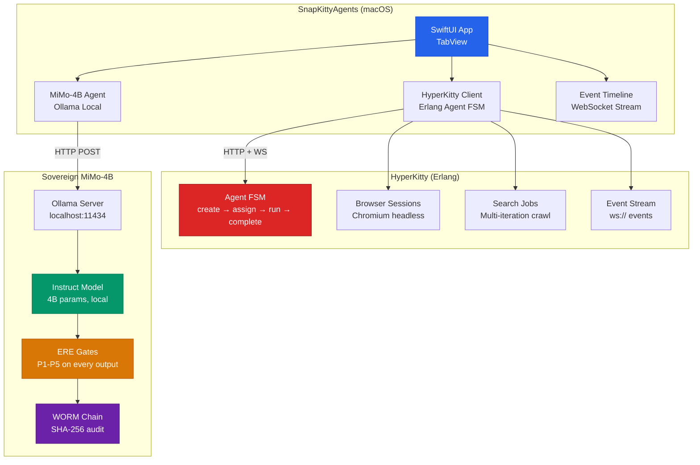
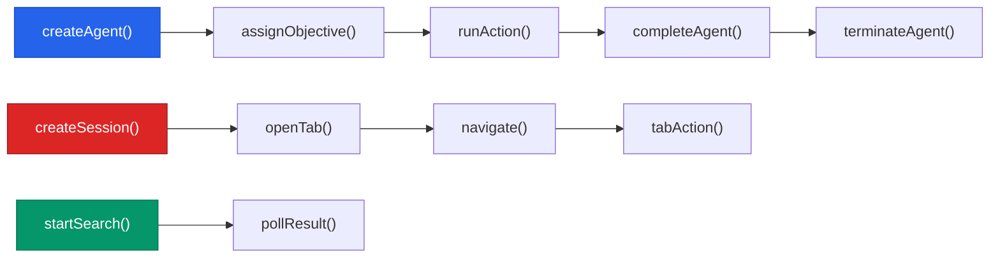
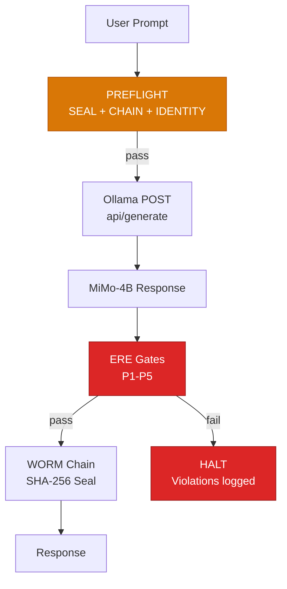

# SnapKitty Agents

[](LICENSE)
[](https://swift.org)
[](https://www.apple.com/macos/)
[](#hyperkitty)
[](#mimo-4b-instruct)
[](#ere-gates)
[](#worm-chain)

> **Sovereign agent orchestration. HyperKitty browser automation. MiMo-4B instruct model. ERE gates + WORM chain. No cloud.**

---

## Architecture



---

## What This Is

A macOS SwiftUI application that provides:

1. **HyperKitty Agent Orchestration** — Interface with Erlang-based agent FSM for browser automation, search jobs, and multi-step workflows
2. **Sovereign MiMo-4B Instruct** — Local AI assistant running on Ollama, no cloud dependency
3. **Event Timeline** — Real-time WebSocket stream of agent events
4. **ERE Gates** — Five-gate verification on every MiMo output
5. **WORM Chain** — Append-only SHA-256 audit trail

---

## Components

### HyperKitty Client



| Endpoint | Description |
|----------|-------------|
| `createAgent(capabilities:)` | Spawn new agent with capabilities |
| `assignObjective(agentId:description:)` | Set agent goal |
| `runAction(agentId:command:)` | Execute agent action |
| `createSession(ownerAgentId:)` | Create browser session |
| `openTab(sessionId:url:)` | Open new tab |
| `startSearch(query:ownerAgentId:maxIterations:)` | Multi-iteration search |
| `eventStream()` | WebSocket event stream |

### MiMo-4B Instruct Agent



| Feature | Value |
|---------|-------|
| Model | sovereign-mimo-4b (Q4_K_M) |
| Server | Ollama (localhost:11434) |
| Parameters | ~4B |
| Context | 8192 tokens |
| Temperature | 0.7 |
| Top-P | 0.9 |

### ERE Gates

Every MiMo output passes through 5 verification gates:

| Gate | Name | Check | Failure |
|------|------|-------|---------|
| P1 | Secrets | No API keys, tokens, passwords | Output suppressed |
| P2 | Injection | No `eval`, `exec`, `subprocess`, `rm -rf` | Output suppressed |
| P3 | Loop Safety | No `while True` without `break` | Output suppressed |
| P4 | Telemetry | No `fetch`, `XMLHttpRequest`, `sendBeacon` | Output suppressed |
| P5 | Seal | SHA-256 audit seal (agent:intent:output) | Seal not generated |

### WORM Chain

Append-only SHA-256 audit chain. Every entry links to previous hash.

```
Entry[0]: genesis
Entry[1]: seq=1, timestamp, model, prompt_hash, output_hash, verdict, hash_prev=Entry[0].hash
Entry[2]: seq=2, timestamp, model, prompt_hash, output_hash, verdict, hash_prev=Entry[1].hash
...
```

---

## Setup

### Prerequisites

- macOS 14+ (Sonoma)
- Xcode 15+ with Swift 5.9
- Ollama installed (`brew install ollama`)
- sovereign-mimo-4b model pulled

### Install Ollama & Model

```bash
# Install Ollama
brew install ollama

# Start Ollama server
ollama serve

# Pull sovereign-mimo-4b
ollama create sovereign-mimo-4b -f /path/to/sovereign-mimo-4b/Modelfile
ollama run sovereign-mimo-4b
```

### Build & Run

```bash
# Clone
git clone https://github.com/SNAPKITTYWEST/snapkitty-agents
cd snapkitty-agents

# Open in Xcode
open Package.swift

# Build
swift build

# Run
swift run SnapKittyAgents
```

---

## Configuration

### HyperKitty

```swift
// Settings → HyperKitty
Base URL: http://localhost:8080
API Key: (optional)
```

### MiMo-4B

```swift
// MiMoConfig.default
Base URL: http://localhost:11434
Model: sovereign-mimo-4b
Max Tokens: 512
Temperature: 0.7
Top-K: 50
Top-P: 0.9
```

---

## Files

```
snapkitty-agents/
├── Package.swift                    # Swift 5.9, macOS 14+
├── Sources/SnapKittyAgents/
│   ├── App/
│   │   └── SnapKittyAgentsApp.swift # Main app, TabView
│   ├── Models/
│   │   ├── Agent.swift              # HyperKitty agent model
│   │   ├── AgentCommand.swift       # Agent commands
│   │   ├── AgentState.swift         # Agent states
│   │   ├── AgentTelemetry.swift     # Telemetry data
│   │   ├── BrowserEvent.swift       # Browser events
│   │   └── MiMoInstructAgent.swift  # Sovereign MiMo-4B agent
│   ├── Networking/
│   │   ├── EventStream.swift        # WebSocket event stream
│   │   └── HyperKittyClient.swift   # HyperKitty HTTP client
│   ├── State/
│   │   ├── AgentSessionManager.swift
│   │   └── AgentStore.swift
│   ├── UI/
│   │   ├── AgentStatusView.swift
│   │   ├── BrowserPane.swift
│   │   ├── CommandBar.swift
│   │   ├── EventTimeline.swift
│   │   ├── JITAgentBox.swift
│   │   ├── MiMoAgentView.swift      # MiMo chat UI
│   │   ├── SessionPicker.swift
│   │   ├── SettingsView.swift
│   │   └── TelemetryPanel.swift
│   └── Utilities/
│       ├── DesignSystem.swift
│       └── Logger.swift
├── Tests/
│   └── SnapKittyAgentsTests/
└── README.md
```

---

## Sovereign Stack

| Component | Source | Pattern |
|-----------|--------|---------|
| HyperKitty | HK API | Erlang agent FSM, browser automation |
| MiMo-4B | sovereign-mimo-4b | Ollama local instruct model |
| ERE Gates | bert-agent | P1-P5 verification, halt on failure |
| WORM Chain | DEVFLOW-FINANCE | Append-only SHA-256 audit chain |
| FSM | DEVFLOW-FINANCE | IDLE → PREFLIGHT → REASONING → SEALING → RESPONDING |

---

## License

Tri-licensed: **Sovereign Source License v1.0** (Bel Esprit d'Accord Trust, 2026-06-01) | **BSL-1.1** (Change Date 2030-06-01 → Apache 2.0) | **AGPL-3.0**.

Copyright (C) 2026 Ahmad Ali Parr <ahmedparr93@gmail.com> / Jessica <jessica@snapkitty.com>
Bel Esprit D'Accord Irrevocable Trust · EIN 42-697643

---

*Built on BBQBADDIE. No cloud. No vendor. Sovereign.*
